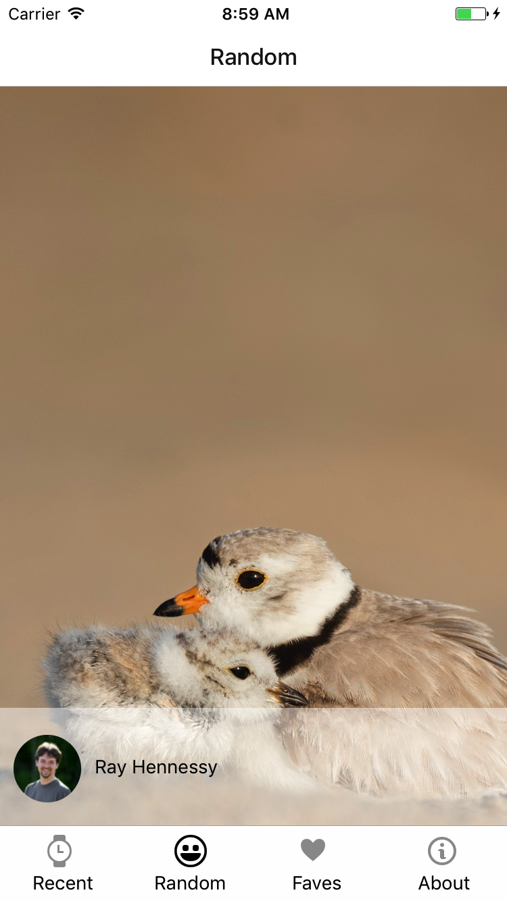

# Splash

I built a mobile application using React Native that accesses the Unsplash API to allow users to view recently 
posted photos and store their favourite photos in a database.

This project is cross-platform (iOS/Android) and contains a database (Realm).